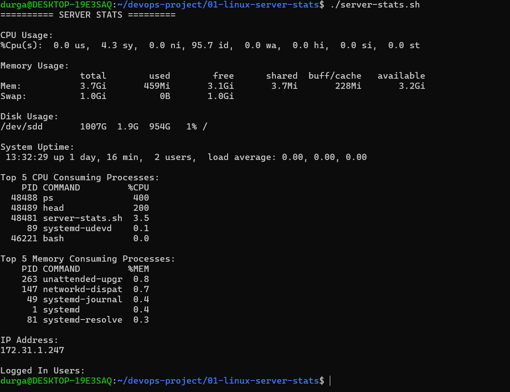

# Linux Server Stats

## Project Overview

This is a Bash script that displays basic Linux server information.

## Features

* CPU Usage
* Memory Usage
* Disk Usage
* System Uptime
* Top 5 CPU Consuming Processes
* Top 5 Memory Consuming Processes
* IP Address
* Logged-in Users

## Technologies Used

* Bash
* Linux (Ubuntu)

## How to Run

```bash
chmod +x server-stats.sh
./server-stats.sh
```
## Sample Output


